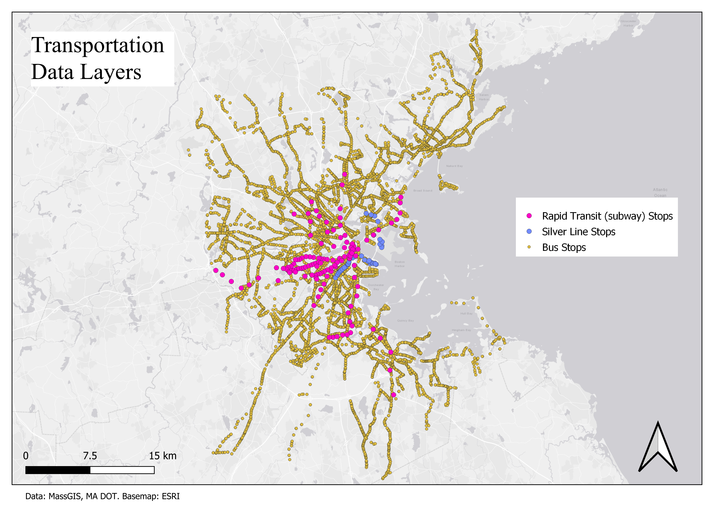

# Public Transit Group Project
## IDCE 376
Adlai Nelson, Isack Walube, Rory Dickinson

### Introduction
In an era characterized by rapid urban development, the effectiveness of public transportation networks is vital for the welfare of urban dwellers. This project evaluates the efficiency of public transit systems in Boston, focusing on metrics such as coverage, frequency, and connectivity across various block groups. By conducting a comprehensive analysis, we aim to derive actionable insights that can refine transit systems, ultimately enhancing accessibility and sustainability in public transportation.
This project aims to address issues such as; accessibility and equity, urban mobility optimization, resource allocation, environmental sustainability, and data-driven decision-making by gaining insights into historical trends to identify areas for improvement. 

### Data

Transportation data, including bus and subway stops, as well as which route was associated with the stops, were downloaded from MassGIS (See figure 1). Reliability data for 2015 - March 2024 were downloaded from the MBTA open data portal. 

Figure 1

Demographics data, US Census tracts containing data regarding median household income. Data collected by the American Community Survey was downloaded from ESRI's Covid-19 Resources page. The original dataset was for the entire United States but was clipped down to the Boston Metropolitan Area, as defined by the Metropolitan Area Planning Council. The clip layer was created from a Massachusetts town boundary shapefile downloaded from MassGIS.

Figure 2

Sources:
[Demographics](https://coronavirus-resources.esri.com/datasets/esri::county-28/explore?location=33.307776%2C-119.918825%2C4.00)

[MA Cities](https://www.mass.gov/info-details/massgis-data-2020-us-census-towns)

[MBTA Rapid Transit](https://www.mass.gov/info-details/massgis-data-mbta-rapid-transit)

[MBTA Bus](https://www.mass.gov/info-details/massgis-data-mbta-bus-routes-and-stops)

[Reliability Data](https://mbta-massdot.opendata.arcgis.com/datasets/b3a24561c2104422a78b593e92b566d5_0/explore)

#### Data preprocessing

Spatial Data was processed in QGIS. All layers were reprojected to NAD 83 Massachusetts stateplane, and clipped to the study area region.

Reliability data were preprocessed using R 4.3.2. Reliability metrics were averaged for each bus and rapid transit route across the lifespan of the data. 
Data for the silver line was listed as 'bus' in the reliability metrics, but 'rapid transit' in the subway stops dataset, so it was seperated out.

#### Table normalization
The empty tables in `create_tables.csv` will be 1NF and 2NF compliant, as they have atomic values, do not rely on the order of data, each column has a name, and columns have the same data type. 
The tables will also be 2NF compliant, as none of them have a composite key, having only one primary key each.
To achieve 1NF compliance, some values will have to be split out, as the current state of the subway stops data lists multiple lines in the same entry.
This will have to be seperated, emulating the style of the bus stops events table, wich is already normalized in this way. 

