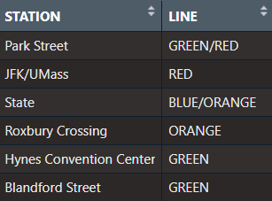
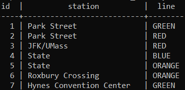
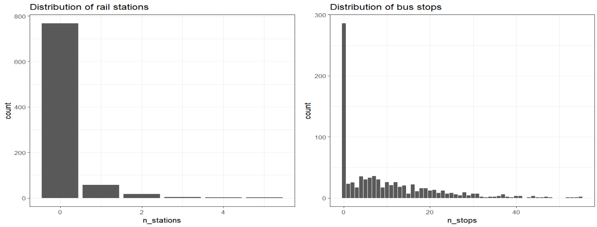
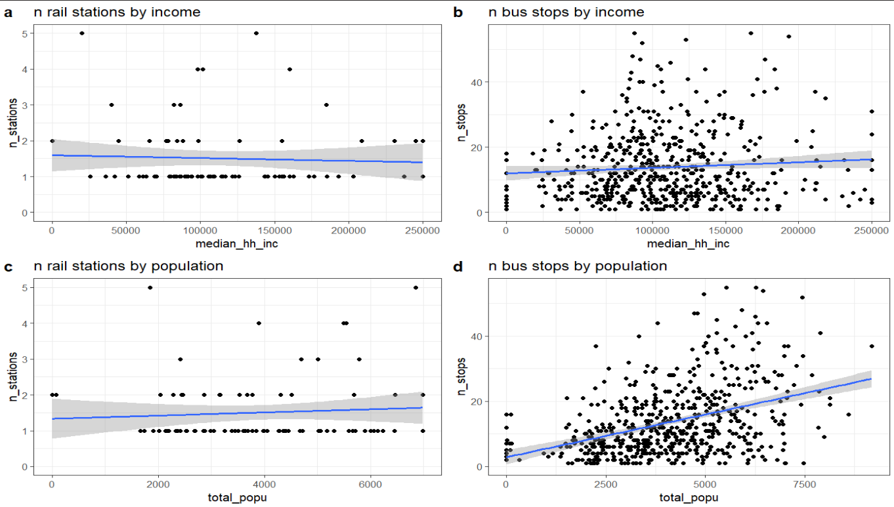
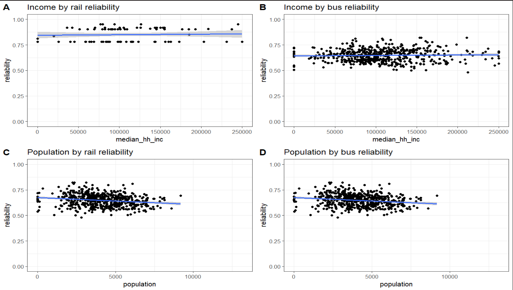
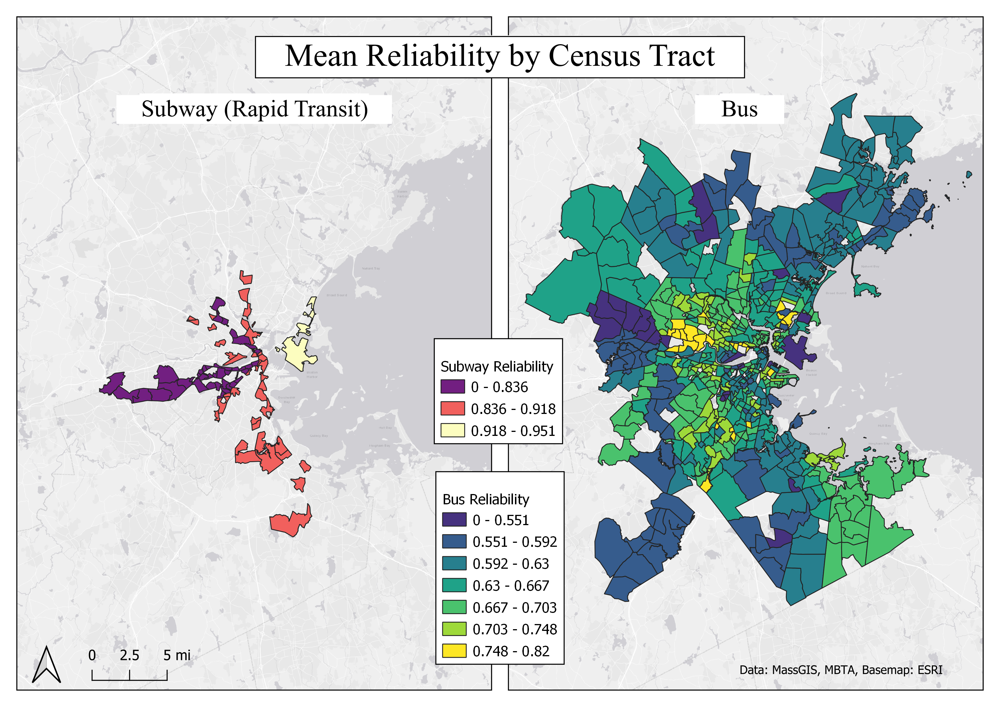

# Public Transit Group Project
## IDCE 376
Adlai Nelson, Isack Walube, Rory Dickinson

### Introduction
In an era characterized by rapid urban development, the effectiveness of public transportation networks is vital for the welfare of urban dwellers. This project evaluates the efficiency of public transit systems in Boston, focusing on metrics such as coverage, frequency, and connectivity across various block groups. By conducting a comprehensive analysis, we aim to derive actionable insights that can refine transit systems, ultimately enhancing accessibility and sustainability in public transportation.
This project aims to address issues such as; accessibility and equity, urban mobility optimization, resource allocation, environmental sustainability, and data-driven decision-making by gaining insights into historical trends to identify areas for improvement. 

### Data

Transportation data, including bus and subway stops, as well as which route was associated with the stops, were downloaded from MassGIS (See figure 1). Reliability data for 2015 - March 2024 were downloaded from the MBTA open data portal. 

Demographics data, US Census tracts containing data regarding median household income. Data collected by the American Community Survey was downloaded from ESRI's Covid-19 Resources page. The original dataset was for the entire United States but was clipped down to the Boston Metropolitan Area, as defined by the Metropolitan Area Planning Council. Another demographics dataset will also be used of US census tracts regarding population count. This data is from the US Census and was retrieved from ESRI's Livign Atlas. Both clip layers were created from a Massachusetts town boundary shapefile downloaded from MassGIS. 

Figure 1

(Made in QGIS)

Sources:

[Demographics](https://coronavirus-resources.esri.com/datasets/esri::county-28/explore?location=33.307776%2C-119.918825%2C4.00) - Median Household Income Census Tract Data

[MA Cities](https://www.mass.gov/info-details/massgis-data-2020-us-census-towns) - Massachusetts Towns

[MBTA Rapid Transit](https://www.mass.gov/info-details/massgis-data-mbta-rapid-transit) - Rapid Transit Stop Data

[MBTA Bus](https://www.mass.gov/info-details/massgis-data-mbta-bus-routes-and-stops) - Bus stop Data

[Reliability Data](https://mbta-massdot.opendata.arcgis.com/datasets/b3a24561c2104422a78b593e92b566d5_0/explore) - Transit Reliability

ESRI Living Atlas - Population Census Tract Data

#### Data preprocessing

Spatial Data was processed in QGIS. All layers were reprojected to NAD 83 Massachusetts stateplane, and clipped to the study area region.

Reliability data were preprocessed using R 4.3.2. Reliability metrics were averaged for each bus and rapid transit route across the lifespan of the data. 

#### Table normalization
The Bus data did not require any normalization. From Massgis/MassDOT, there was one table containing bus stop IDs and the point location, and one table containing the IDs and each bus stop, where each unique combination of ID and bus stop was on its own row. This was compliant with 1NF, as all of the values were atomic. In addition, they were all of the same type, and order did not matter. 

The rail stops data had to be normalized.
This shapefile listed station ID, station location, and the lines that serviced the station. 
There sometimes multiple lines serviced the same station, so the data was normalized by creating a seperate table (rail_events) to store station names and routes. 
They were normalized, so each place where a route name was repeated it was instead on its own row. Since both, route name and station ID repeated in the table, a new event ID table had to be created.

Non normalized rail data:

Normalized rail data:

### Methods

To load in the data to a database, the following sql scripts must be run in postgres:
bus_points.sql, rail_points.sql, demographics.sql, and read_csv.sql.
These files are contained within the sql folder.
Note: read_csv.sql must be run in command line psql, as PGAdmin does not support the \copy command

Next, analysis.sql was run. The outputs of each query were exported as .csv and imported into QGIS and R to visualize.
The package ggplot2 for R software was used for graphical visualizations. 
The data was plotted and trendlines were drawn using the geom_smooth command and 'lm' model.

### Results

